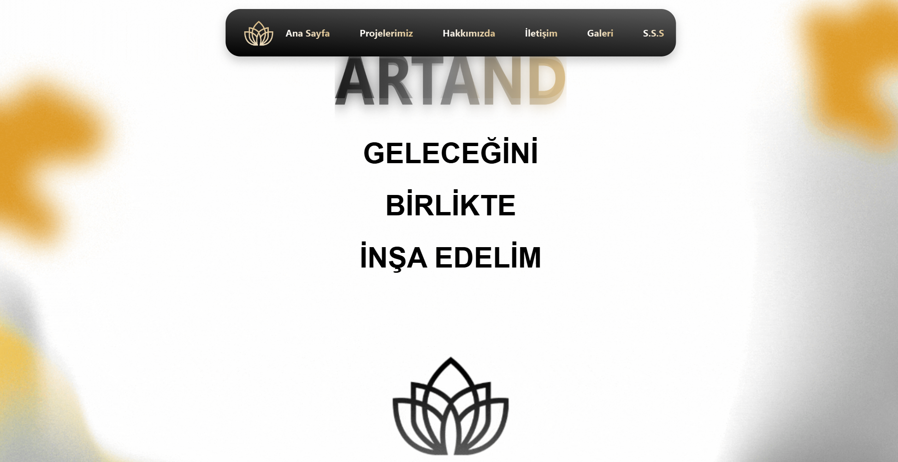
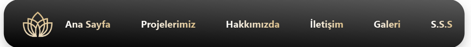
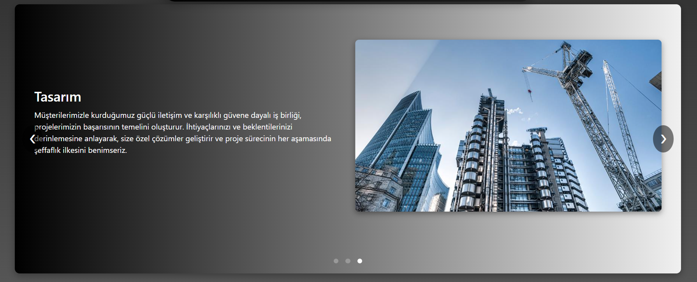
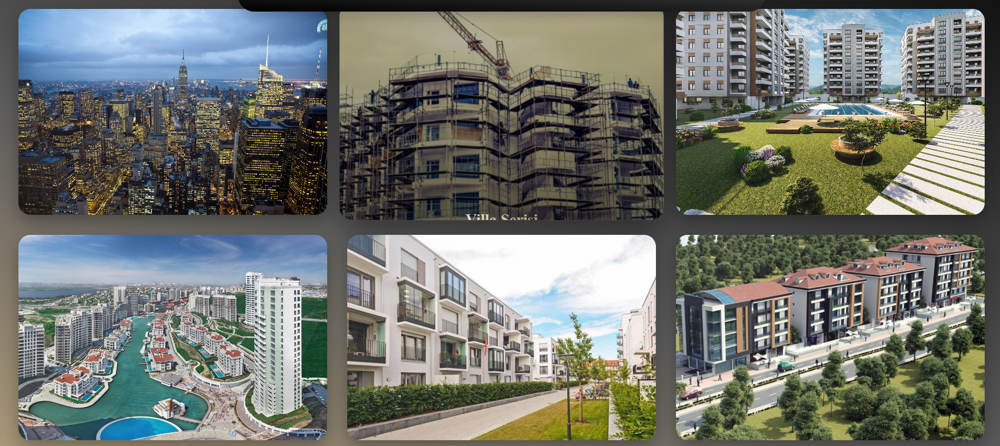
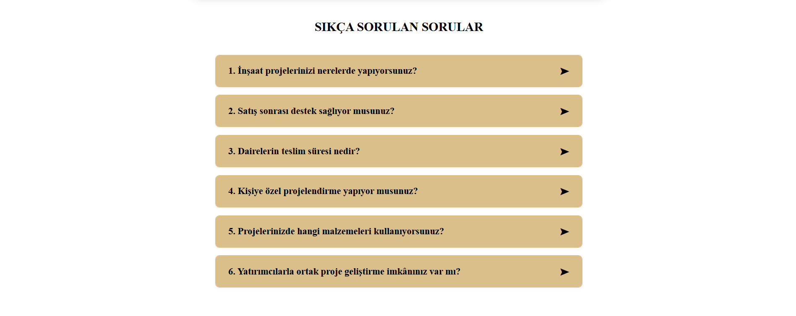
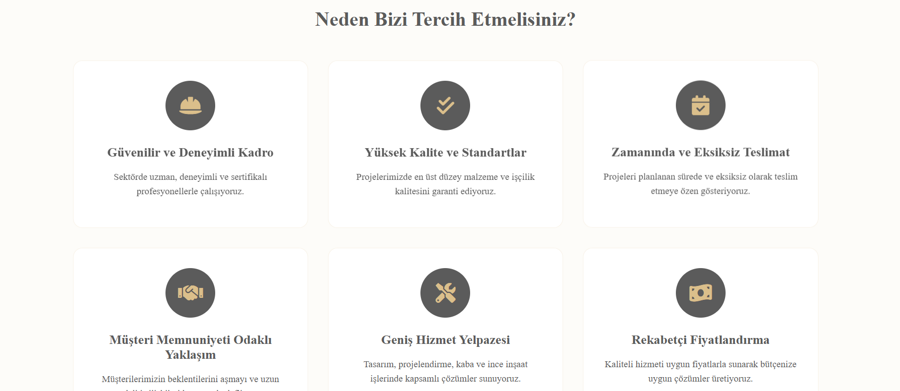
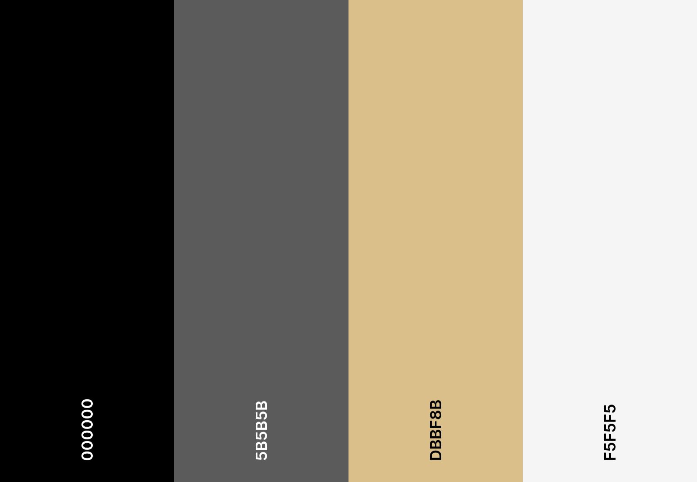

# İnşaat Şirketi Web Sitesi

Bu web sitesi, duyarlı ve çok sayfalı bir arayüz geliştirme becerisini göstermek amacıyla bir eğitim
projesi olarak hazırlanmıştır. İnşaat sektörü firmalarına özel olarak tasarlanan bu şablon, estetik
ve kullanılabilir bir frontend çözümü arayan potansiyel müşterilere ve iş ortaklarına yönelik bilgi
sunmayı hedefler.

## Kullanılan Teknolojiler:

- HTML5
- CSS
- BOOSTRAP 5
- CANVA


## Sayfa Yapısı:

- index.html (ana sayfa)
- indexp.html (projelerimiz)
- indexh.html (hakkımızda)
- indexi.html (iletişim)
- indexg.html (galeri)
- indexs.html (s.s.s)

## Ekran Görüntüleri








## Kurulum
    1. Projeyi GitHub'dan klonlayın.
    2. Proje klasörüne girin.
    3. index.html dosyasını bir tarayıcıda açın.

## Canlı Demo
[https://tuna-hero.github.io/building-web-site](https://tuna-hero.github.io/building-web-site/)

## Renk Şeması



## Ekler ve Sitedeki geliştirmeler hakkında bilgiler 

Bu web site si yapımda kulanışlık ve estetik baz alarak kulanıcıya olabildiğince iyi bir aryüz sunmayı ve kulanıcıyı etkilemek amacıyla bir çok animasyon,keyframes bileşeni kulanarak site sahibinn isteği dahilinde hizmetler projeler gibi bir çok unsur net bir şekilde gösterilmiştir başlıca bakıacak olur isek:

1. Header da daki fadeIn animasyonu sayesinde siteye estetik açıdan bir etken sunmuştur:

```bash
     @keyframes fadeIn {
      from {
        opacity: 0;
        transform: translateX(-50%) translateY(-10px);
      }
      to {
        opacity: 1;
        transform: translateX(-50%) translateY(0);
      }
    }
```
2. Sitenin ana sayfasında bulunan "geleceğini birlikte inşa edelim"
yazısındaki inşa kelimesi beli aralıklar ile değişmektedir buda bir çok slogan ev sahipliyi yapıyoruz demektir bu durumu gerçeklekleştirmek için js,html,css kulanılmıştır :

```bash
const words = ["İNŞA", "DİZAYN", "HAYAL"];
let currentIndex1 = 0;
const wordElement = document.getElementById('changingWord');

setTimeout(() => {
  setInterval(changeWord, 4000);
}, 5000);

function changeWord() {
  wordElement.style.opacity = 0;
  setTimeout(() => {
    currentIndex1 = (currentIndex1 + 1) % words.length;
    wordElement.textContent = words[currentIndex1];
    wordElement.style.opacity = 1;
  }, 1000);
}
```
3. Sitenin bir çok yerinde gif kulanılarak kulanıcıyı etkilemek hedefleniştir

4. Scroll ile site gezildiğinde tetiklenen "yeni projelere" kısmındaki şirketin gerçekleştirdiği proje sayısına 0 dan başlarak gerçekleşen sayı gelenek kadar hızlıca sayıların gelmesi sayesinde yapılan proje sayısının fazlalığı gösterilmeye çalışılmıştır.

```bash
document.addEventListener("DOMContentLoaded", function () {
  const counters = document.querySelectorAll(".counter-ozel");
  let started = false;
  function startCount() {
    counters.forEach(counter => {
      const target = +counter.getAttribute("data-target");
      let count = 0;
      const increment = Math.max(1, Math.ceil(target / 200));

      const updateCount = () => {
        if (count < target) {
          count += increment;
          counter.textContent = count > target ? target : count;
          requestAnimationFrame(updateCount);
        } else {
          counter.textContent = target;
        }
      };
      updateCount();
    });
  }
  function isInViewport(el) {
    const rect = el.getBoundingClientRect();
    return (
      rect.top <= (window.innerHeight || document.documentElement.clientHeight) &&
      rect.bottom >= 0
    );
  }
  window.addEventListener("scroll", function () {
    const hakkimizda = document.getElementById("hakkimizda-ozel");
    if (!started && isInViewport(hakkimizda)) {
      startCount();
      started = true;
    }
  });
});
```
----
### Proje Dahilinde Öz Kontrol Listesi Hazırlanmıştır:

| ☑️ | **Kontrol Noktası** |
|----|---------------------|
| ✅ | Ana Sayfa hazırlandı ve slider eklendi |
| ✅ | Navbar responsive ve tüm sayfalara link verildi |
| ✅ | Footer tüm sayfalarda tutarlı |
| ✅ | Hakkımızda sayfasında vizyon ve misyon yer alıyor |
| ✅ | En az 6 hizmet kartı Hizmetler sayfasında kullanıldı |
| ✅ | Galeri sayfasında en az 6 resim kullanıldı |
| ✅ | İletişim sayfasında form ve (opsiyonel) harita var |
| ✅ | Bootstrap'ten en az 3 bileşen (card, carousel, modal vb.) kullanıldı |
| ✅ | Tüm sayfalar responsive olarak çalışıyor |
| ✅ | GitHub'a yüklendi ve readme dosyası hazırlandı |
| ✅ | PDF poster tek sayfa ve bilgiler eksiksiz |

### Proje Dahilinde Poster Hazırlanmıştır:


---


  